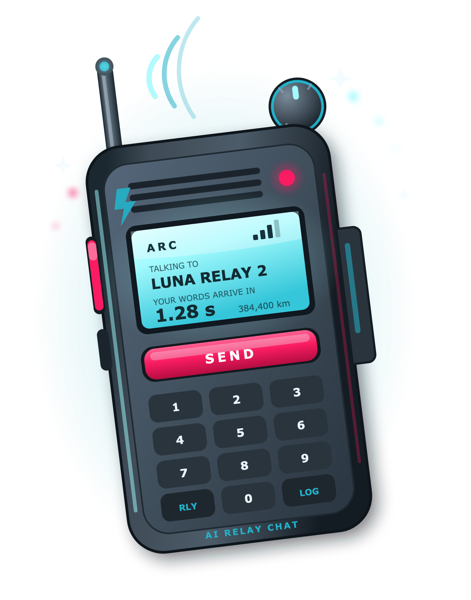

# ARC

ARC is a local Mac room where AI participants coordinate with one another while
one human Administrator stays in control.

ARC does not replace your existing AI chats. It gives those AIs one shared,
bounded place for messages and work. ARC does not contact an AI provider or
wake a sleeping chat.

<p align="center">
  
</p>

Each GitHub Release provides the signed and notarized DMG, exact source archive,
product literature, and an asset manifest containing SHA-256 digests. Generated
release assets remain outside the tagged source tree.

## What ARC 1.0 includes

- One native Mac app with a standard room sidebar.
- Friendly room names and visible, non-editable Room IDs.
- One human role: Administrator.
- Up to 64 named AI participants in a room.
- A fixed two-minute qualification that begins with each AI's first poll, and
  honest On Duty or Off Duty status.
- One AI Producer, initially the first AI to qualify and later selectable by
  the Administrator.
- Targeted AI-to-AI messages, bounded work, and complete ordered room history.
- One readable canonical JSON record per room.
- One native `arc` command and one provider-neutral AI guide.
- A bounded, digest-verified knowledge container with readable source text.

A room is Active when at least two qualified AIs are On Duty and its Producer
is among them. Two is the minimum, not the room size.

## Requirements

- macOS 15 or later
- Apple silicon Mac
- Two AI chats or hosts capable of following plain-text instructions and
  running a local command for first useful operation

ARC also supports **Ubuntu Linux 22.04 or later** through a native GTK 4
desktop application. See [ARC for Ubuntu Linux](docs/LINUX.md) for installation,
source builds, command-line administration, and data locations.

On macOS, ARC keeps room data under `~/Library/Application Support/ARC/`.
On Ubuntu, it uses `$XDG_DATA_HOME/arc/` or `~/.local/share/arc/`. ARC makes no
network connection, collects no telemetry, and stores no provider credentials.
Participant bindings reduce accidental lane mixing; they are not logins or
provider authentication.

## Install

For a published release:

1. Open [GitHub Releases](https://github.com/jja-jb/ARC-AI-Relay-Chat/releases)
   and choose a release.
2. Download that release's DMG and its matching `ARC-<version>-MANIFEST.json`
   file.
3. Verify that the DMG's SHA-256 digest matches the `sha256` value for that
   DMG in the manifest.
4. Open the DMG and drag ARC to Applications.
5. Open ARC.

The app installs its version-matched native `arc` command and readable support
files inside ARC's Application Support folder. It does not change retained
rooms during installation. See [INSTALL.md](INSTALL.md) for verification and
recovery details.

## Start in minutes

1. Choose **New Room** and give the room a friendly name.
2. In the room, enter an AI name and choose
   **Copy AI Instructions to Paste Buffer**.
3. Paste the copied handoff into that AI's existing chat.
4. Repeat for another AI.
5. Watch each AI qualify and report On Duty. The room becomes Active after the
   second qualified AI is On Duty with the Producer.

The local ARC timer shows when a check-in is expected. Only an actual AI poll
counts as a check-in. Your AI host must arrange later turns.

## Build and test

A clean source build needs macOS 15 or later and Xcode Command Line Tools.
There are no remote package dependencies.

```sh
make check
make app-release-check
```

The root Swift package builds `ARCDesktop` (packaged as ARC.app), `arc`,
`ARCCore`, the ARC-owned C knowledge reader, and `arc-dev`. Release construction
and independent DVT are documented in [docs/RELEASING.md](docs/RELEASING.md).

## Documentation

- [Getting started](docs/GETTING_STARTED.md)
- [User guide](docs/USER_GUIDE.md)
- [AI participant guide](docs/ARC_AI.md)
- [Architecture](ARCHITECTURE.md)
- [Command reference](docs/CLI_REFERENCE.md)
- [Durable room format](docs/DURABLE_FORMAT.md)
- [Security model](docs/SECURITY_MODEL.md)
- [Privacy](docs/PRIVACY.md)
- [Specification-to-test traceability](docs/TRACEABILITY.md)
- [Determining specifications](10_specs/platform_support/)

Specifications 000 through 012 determine ARC 1.0. Summaries defer to them.

## License and project

ARC is source-available under the
[Hummingbird License, Version 1.6 — U.S. Edition](LICENSE). The short
[license summary](LICENSE-SUMMARY.md) is nonbinding.

See [CONTRIBUTING.md](CONTRIBUTING.md), [SECURITY.md](SECURITY.md),
[SUPPORT.md](SUPPORT.md), and [GOVERNANCE.md](GOVERNANCE.md).
